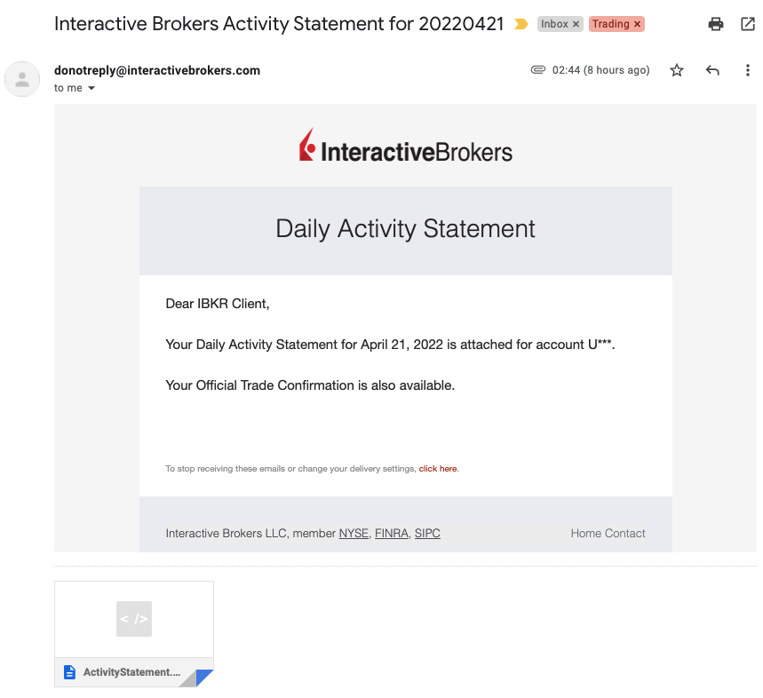
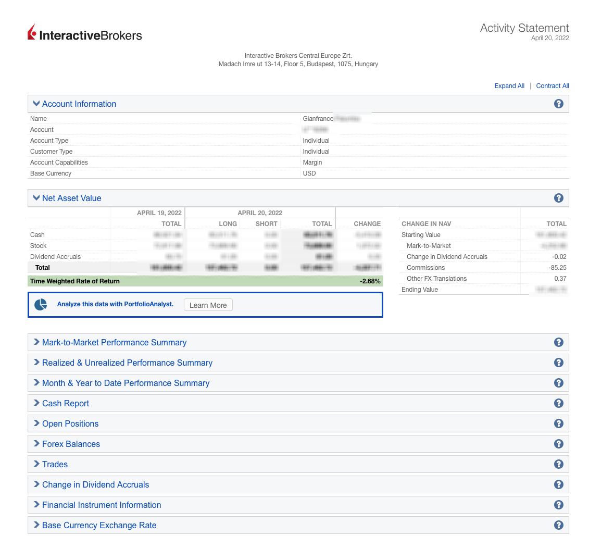

# Interactive Brokers Email Parser

Retrieve the values from the HTML attachments in the emails from Interactive Brokers.





e.g. `ActivityStatement.20220420.html`
e.g. `DailyTradeReport.20220420.html`

## Instructions

TODO:

- [ ] Document how to configure your account to get the emails
- [ ] Document how to set up the Google Script

## Example output

```text
$ npm run start
Parsing ActivityStatement.20220422.html...
Parsing DailyTradeReport.20220422.html...

Starting Value: 800.42
Mark-to-Market: -252.8
Dividends: 81.0081
Withholding Tax: -12.16
Change in Dividend Accruals: -0.02
Commissions: -5.25
Other FX Translations: 0.37
Ending Value: 462.72

Number of Trades: 23
Number of Buy Trades: 12
Number of Sell Trades: 11

# Cash Report

Trades (Sales): 4069.04
Trades (Purchase): -9399.6

# Realized & Unrealized Performance Summary

Realized Stocks: -107.48
Unrealized Stocks: -206.93
```

## Todo

### Script

- [ ] Write Google Script to read your emails every night at 3 AM GMT +1
  - [ ] Create Google Script from a Google Spreadsheet.
  - [ ] Find 2 emails from `donotreply@interactivebrokers.com` from the last 24 hours.
  - [ ] Use labels or read/unread to mark as parsed.
  - [ ] Parse the email HTML contents (figure out how to load `cheerio` library on Google Script or a similar)
  - [ ] Update the Spreadsheet row
    - [ ] Add a public example Google Spreadsheet to Github.
  - [ ] (nice to have) Reply to the 2 emails and report what was parsed and the link to the Google Spreadsheet
  - [ ] (nice to have) Link to Telegram bot (carrot bot) to notify me that the Spreadsheet has been updated and what was parsed - or if an error has occurred

### Activity Statement email

- [ ] Deposits & Withdrawals
- [x] Dividends
- [x] Withholding Tax
- [x] Change in Broker Fee Accruals
- [x] Broker Fees
- [ ] Interest
- [ ] Change in Interest Accruals

### Daily Trade Report email

- [x] Realized & Unrealized Performance Summary
